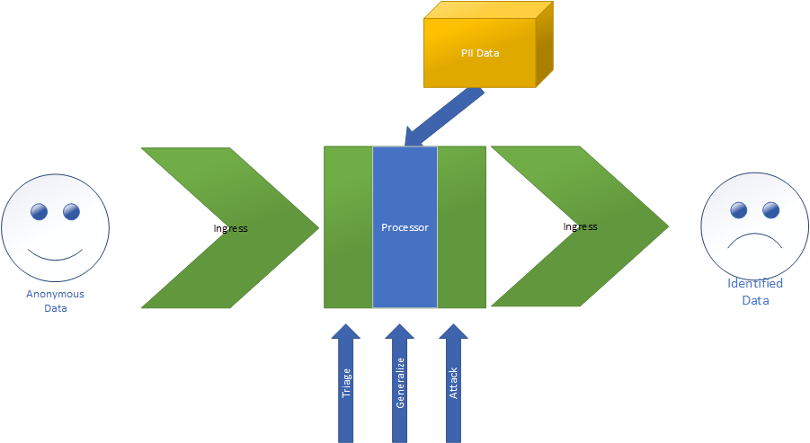

# MICS 233 Privacy Engineering Implementation

## Group Members

Aaron, Cameron, Zach

## Deanonymization at Scale

We are aware of multiple high profile papers in which allegedly anonymized datasets with lower $k$ values are deanonymized.  The process is very straightforward, consisting only of matching generalizations of two tables and performing
the equivalent of a SQL inner join.  

Given the relative ease of attacking a dataset, we would like to design a system that automates deanonymization on a large scale.  This process consists of three primary stages that make up a typical big data pipeline:

- Ingress, in which anonymous data is collected from various sources
- Processing, in which data is selected and attacked
- Egress, in which we prepare the identified data for additional processing and interpretation.

Our design allows the system to scale to process arbitrary amounts of data.  By leveraging off the shelf cloud technologies, we can use adaptations of code already written in class (specifically in Labs 2 and 3) to achieve
this scale.  Should we run into unforeseen challenges, a small subset of the proposed milestones would satisfy the requirements for W233.

We must do some preparatory work before we are able to successfully start deanonymizing any amount of data.  

- First and foremost, we must gather and curate a corpus of personally identifiable information to match against.  This should be publically available data, and must be cataloged appropriately.
Desirable data we would look for should include a Full Name along with a handful of Quasi Identifiers that we can match on.  An example of this is publicly available voter registration forms, which many states provide to anyone who asks.
- Next we must identify a small set of Quasi Identifiers that will produce small equivalence classes in our datasets.  We will use this set in order to determine if a dataset we encounter at Ingress is worth ingesting or not.
- Finally, we must produce generalization hierarchies of the PII that we will be able to use to generate generalizations for higher quality re-identifications.  

### Ingress

We will set up a lightweight python application that scrapes the Internet for csv formatted text.  The scraper would download those CSVs and create a PostgreSQL table from the data.  It would then create metadata about where the table is from,
what type of data it is, etc.  This metadata will be treated as a queue by the processor.
We aim to have many tables in the database for the Processor to select and deanonymize data that meets specific criteria we will define.  

Potential data sources:

[data.gov](https://www.data.gov/)

[Internet Archive](https://archive.org/web/)

[r/datasets](https://www.reddit.com/r/datasets/)

[GoogleData](https://toolbox.google.com/datasetsearch)

[BerkeleyData](https://dlab.berkeley.edu/data-resources/data)

By packaging the scraper in a simple Docker container, we can host multiple instances quickly and divide up scraping work between them.  

### Data Processing

We would like to use Jupyter notebooks in light of having access to the MIDS instance.  We intend to implement them offline in R and then upload them to the cluster where they will have knowledge of the ingress.
We need three notebooks minimum:

- Triage for analyzing the datasets and finding weaknesses.  This notebook would identify the next available dataset out of the DB using the metadata table, load the appropriate table, and then analyze the table's $k$-anonymity.
 If the $k$ value is over a certain threshold that we need to tune, the table can be dropped and the dataset should be marked as safe in the metadata.
- If the $k$ value is below a certain threshold, we must then attempt to match generalizations.  For every table that gets to this stage, we can try multiple levels of generalization of the PII data to get the closest matches. As we generalize our PII,
it may be worthwhile to save the generalizations to improve performance on future datasets.
- Once generalizations have been generated, they should be joined against the dataset we're attacking.  After each join, a $k$ value will be calculated.  If this $k$ is 1, we have re-identified some members of this dataset and should take note of that.  The metadata will be updated with what PII joins produced it, and the resultant set will be stored in egress.
If this $k$ is below a certain threshold, we are likely able to reidentify this data with additional work. We should make note of this and egress the data with a flag.  If the $k$ value is above threshold, the data is safe from that join.  If all PII joins are exhausted, the data is safe from our system and should be noted in the metadata.

We may consider additionally having a notebook for more serious data cleaning, and additional notebooks for targeting specific weaknesses (separate diversity attacks, for instance).

### Egress

We intend to use another PostgreSQL DB for Egress. As datasets are reidentified, we will create tables in this DB along with a metadata table containing information about where the original data came from.  This metadata table can give us insights into what types datasets our Processor is able to best identify.  
When combined with the Ingress metadata, we can hopefully tell a story about what types of data tends to be weak against simple join attacks and what types of data is adequately hardened.

### Previous Work

There is a lot of supporting work in this area. The original $k$-anonymity paper, [Protecting Privacy when Disclosing Information: $k$-Anonymity and Its Enforcement through Generalization and Suppression](https://dataprivacylab.org/dataprivacy/projects/kanonymity/paper3.pdf) [Samarati, Sweeny] successfully uses medical records and voter registration to accurately reidentify many individuals.  One of the paper's authors, Sweeny, has numerous other papers in which individuals are reidentified by performing join attacks.

Other similar work is [Robust De-anonymization of Large Datasets (How to Break Anonymity of the Netflix Prize Dataset)](https://arxiv.org/pdf/cs/0610105.pdf) [Narayanan, Shmatikov].  This paper addresses scale in the form of a large dataset, and successfully is able to recreate a large number of records meeting specific critieria.  Additionally, they leverage
a scoring technique to assist their analysis and confidence of an identification.  

To our knowledge, scale in terms of number of datasets deanonymized has yet to be addressed.  In most previous work, data was carefully selected to produce reidentification.

### Feasibility

Though the scope seems ambitious, we already have implemented many components in the form of a Lab or Homework question.
In particular, we have matlab code available for both generalizations and de-anonymization.  The brunt of the effort will come from curating our data via automation and developing a scoring methodology to appropriately rank our results.
Additionally, the first three proposed milestones alone should adequately meet the criteria for the project, allowing for room for growth and further work on the project.

### Contributions

- Aaron will take lead on workbook implementation.
- Cameron will handle ingress & help with data deanon implementation.
- Zach will handle system design, engineering infrastructure and assist in any implementation needed.

### Milestones

1. Data.gov scraper scraper complete
1. $K$-anonymity notebook complete
1. General graph output, basic metrics identified (% success)
1. Basic Triage functionality
1. Scoring mechanism
1. More scrapers
1. Generalization based Triage functionality
1. Pretty graphs, advanced metrics identified (data hotspots)
